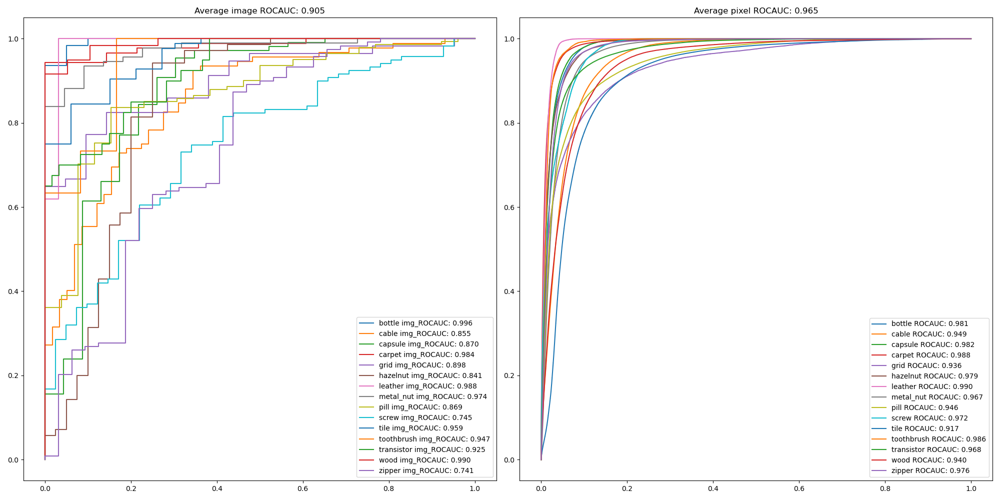
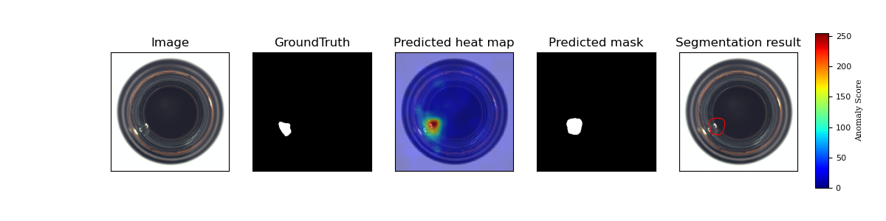
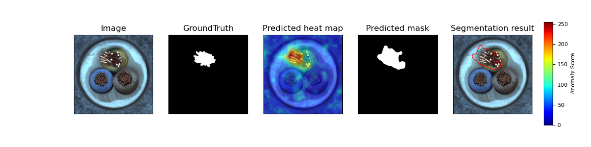
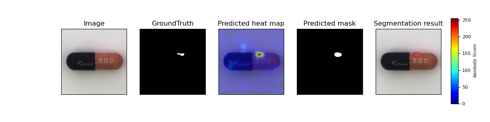
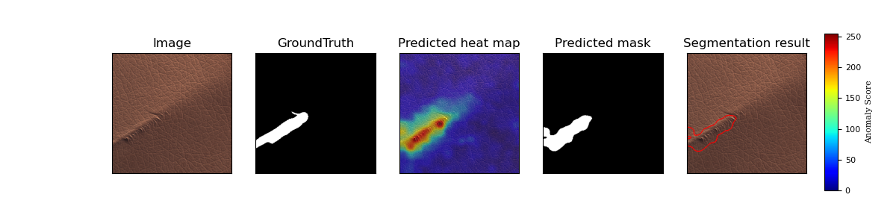
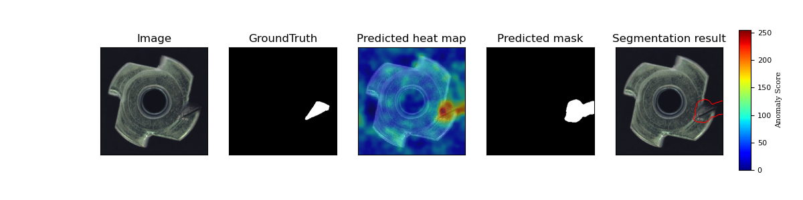

# PaDiM Anomaly Detection and Localization on MVTec Dataset
This is an implementation of the paper [PaDiM: a Patch Distribution Modeling Framework for Anomaly Detection and Localization](https://arxiv.org/pdf/2011.08785).   

This code is heavily borrowed from both SPADE-pytorch(https://github.com/byungjae89/SPADE-pytorch) and MahalanobisAD-pytorch(https://github.com/byungjae89/MahalanobisAD-pytorch) projects
<p align="center">
    
</p>

This repository contains the implementation of **PaDiM (Patch Distribution Modeling)** for anomaly detection and localization on the **MVTec Anomaly Detection** dataset.

## Project Overview

PaDiM is a state-of-the-art unsupervised anomaly detection method that leverages pretrained deep neural network features to model the distribution of normal image patches. It detects and localizes anomalies by measuring the deviation of test image features from this learned distribution.

This project demonstrates:

- Feature extraction using a pretrained Wide_ResNet50_2 backbone.
- Statistical modeling of patch distributions using multivariate Gaussian.
- Anomaly scoring via Mahalanobis distance.
- Evaluation on the MVTec AD dataset for image-level detection and pixel-level localization.

---

## Requirement
* python == 3.7
* pytorch == 1.5
* tqdm
* sklearn
* matplotlib

## Datasets
MVTec AD datasets : Download from [MVTec website](https://www.mvtec.com/company/research/datasets/mvtec-ad/)
You must download and extract the dataset manually into the project directory before running the code.

### Installation

1. Clone this repository:
   ```bash
   git clone https://github.com/xiahaifeng1995/PaDiM-Anomaly-Detection-Localization-master.git
   cd PaDiM-Anomaly-Detection-Localization-master

## Results
### Implementation results on MVTec
* Image-level anomaly detection accuracy (ROCAUC)

|        MvTec        | WR50-Rd550 (Image-level) | WR50-Rd550 (Pixel-level) |
| :-----------------: | :----------------------: | :----------------------: |
|        Carpet       |           0.999          |           0.990          |
|         Grid        |           0.957          |           0.965          |
|       Leather       |            1.0           |           0.989          |
|         Tile        |           0.974          |           0.939          |
|         Wood        |           0.988          |           0.941          |
| All texture classes |           0.984          |           0.965          |
|        Bottle       |           0.998          |           0.982          |
|        Cable        |           0.922          |           0.968          |
|       Capsule       |           0.915          |           0.986          |
|       Hazelnut      |           0.933          |           0.979          |
|      Metal nut      |           0.992          |           0.971          |
|         Pill        |           0.944          |           0.961          |
|        Screw        |           0.844          |           0.983          |
|      Toothbrush     |           0.972          |           0.987          |
|      Transistor     |           0.978          |           0.975          |
|        Zipper       |           0.909          |           0.984          |
|  All object classes |           0.941          |           0.978          |
|     All classes     |           0.955          |           0.973          |


 <!-- ### ROC Curve

* ResNet18

<p align="center">
    
</p>

* Wide_ResNet50_2

<p align="center">
    
</p> -->

### Localization examples

<p align="center">
    
</p>
<p align="center">
    
</p>
<p align="center">
    
</p>
<p align="center">
    
</p>
<p align="center">
    
</p>
<p align="center">
    
</p>
<p align="center">
    
</p>
<p align="center">
    
</p>
<p align="center">
    
</p>
<p align="center">
    
</p>
<p align="center">
    
</p>
<p align="center">
    
</p>
<p align="center">
    
</p>
<p align="center">
    
</p>
<p align="center">
    
</p>

## Reference
[1] Defard, T., Settouti, L., Loesch, A., & Audigier, R. (2020). PaDiM: A Patch Distribution Modeling Framework for Anomaly Detection and Localization. CVPR Workshops.

[2] Li, R., et al. (2021). CutPaste: Self-Supervised Learning for Anomaly Detection and Localization. ICCV.

[3] Yu, Y., et al. (2021). FastFlow: Unsupervised Anomaly Detection and Localization via 2D 

[4]	 MVTec AD Dataset: https://www.mvtec.com/company/research/datasets/mvtec-ad/
